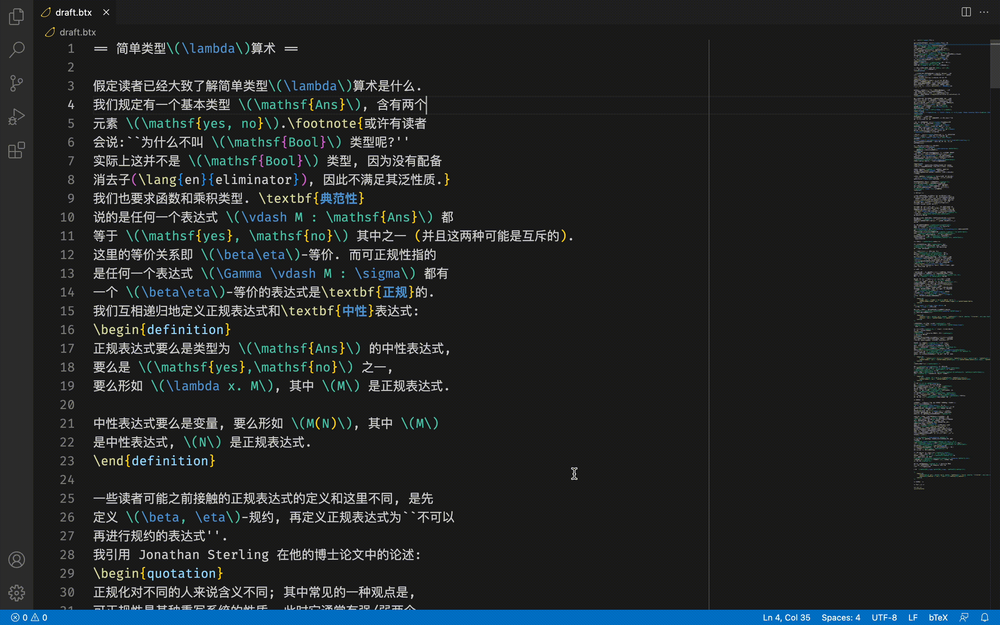

# vscode-btex

VSCode integration for [bTeX](https://github.com/banana-space/btex).

Use the "Compile bTeX to HTML" command in the command palette to start. The
rendered content will update on save.

## Features

- [X] Syntax highlights. (Needs more testing)
- [X] Compiles the bTeX file and show the preview on save.

## Requirements

- Install optionally [tikz2svg](https://github.com/banana-space/tikz2svg). This is used to render TikZ images.

## Extension Settings

- `btex.command` and `btex.directory`: Used to specify the location of tikz2svg. You can leave blank to not let the plugin start up tikz2svg for you.
- `btex.invertAll`: Color settings for formulas, see settings description. It is only relevant in dark themes.

## Known Issues

- If there is an error "tikz2svg server exited with code 1 and signal null", it is most probably because there is another program (possibly another tikz2svg server) running, using the port 9292.
  - If you can still render tikz pictures, and you are sure you didn't start a tikz2svg server yourself, then this is because vscode failed to shut down the tikz2svg server last time. You can use the extension normally, and manually kill the tikz2svg server when you don't need it.
  - If you cannot render tikz pictures, check out which process is using the 9292 port, either terminate it or convince it to use another port instead.
- Wiki templates do not work, because they are stored on wiki servers. I'm not going to implement local wiki templates either. Similarly wiki-style links will show up as blue but don't link anywhere.
- Collapsible proofs do not work (yet) because it requires more javascript machinery.

## Release Notes
